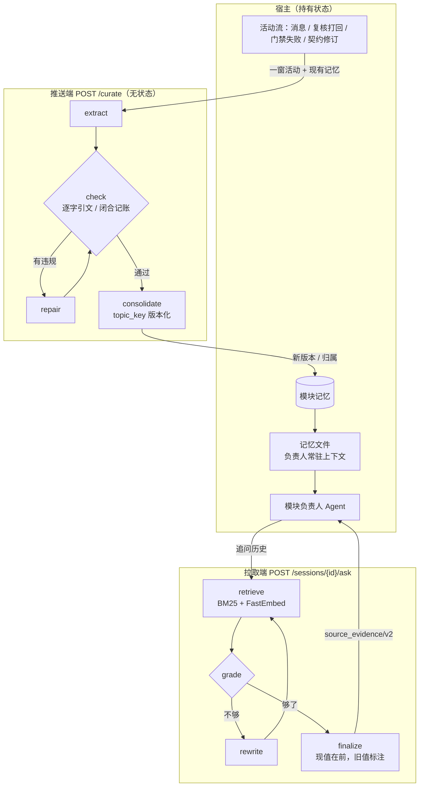

# MemoryOS Lite

[](https://github.com/iiyazu/MemryOS-lite/actions/workflows/ci.yml)
[License: MIT](LICENSE)

面向长对话的 eval-driven、source-attributed Agent/RAG memory prototype。

MemoryOS Lite 研究如何把长期对话中的记忆摄入、检索、上下文组装和来源证明做成可测、可追溯的闭环。它是原型，不是生产级 MemoryOS：当前服务没有完整的远程认证、多租户、限流或生产 ownership model。

## 当前基线

- 默认 `MEMORYOS_MEMORY_ARCH=v3`，使用 layered context composer；`v1` 仅作为显式兼容路径。
- 默认 `MEMORYOS_RECALL_PIPELINE=v2`，使用 episode-first evidence recall；可显式选择 `v1`。
- 记忆策展（curator）默认关闭；`MEMORYOS_CURATOR_ENABLED=true` 时后台 worker 从消息流抽取带来源证明的持久记忆，并通过 `/sessions/{id}/advisories?version=2`（`memoryos_external_advisories/v2`）暴露，由宿主决定是否采纳。worker 是 `/curate` 图的有状态宿主：每一窗消息连同会话现有记忆按 `profile=room` 走同一张图，引文必须是原消息的逐字子串，按 `topic_key` + 版本号确定性汇总新旧版本。
- 模块记忆走无状态的 `POST /curate`（`memoryos_curate/v1`）：宿主（如 xmuse）带上模块现有记忆和一窗新活动，MemoryOS 返回新的记忆版本，自己不存状态。错题本采用闭合记账：每条复核打回和门禁失败都必须归到一条教训或写明理由排除。提炼过程是一张 LangGraph 图（抽取 → 校验 → 修复 → 汇总），见下文"模块记忆"。
- SQLite 是权威存储；page/trace 文件和可选 Redis/Qdrant 都是派生或实验能力。
- 以新鲜命令结果而不是文档中的历史通过数判断状态。

```text
ingest(message)
  -> authoritative Message
  -> episode / page / item / archival derivatives

build_context(task)
  -> v3 ContextComposer
  -> v2 RecallPipeline
  -> bounded ContextPackage with source evidence and diagnostics
```

主要对象包括 `Message`、`Episode`、`MemoryPage`、`MemoryItem`、`ArchivalDocument` / `ArchivalPassage` 和 `ContextPackage`。

## 架构：推送端与拉取端

状态归宿主（如 xmuse 的 `chat.db`），MemoryOS 只做计算。推送端把一窗新活动提炼成带引文的记忆，
宿主把它们渲染成负责人常驻上下文里的记忆文件；拉取端在负责人追问历史时按需检索，旧值带着现值标注
排在后面。



两张图都是 LangGraph，可以离线演示：`memoryos demo curate --mermaid`、`memoryos demo ask --mermaid`。

## 评测结论

结论只写方向，数字和设置见评测记录 `FINDINGS.md` 的对应小节（不随本仓库分发）。所有评测里回答模型与
评委属同一模型家族，数据集由 LLM 起草并经规则校验；行为评测的种子仓库技术债由评测设计者按活动历史手写。

| 结论 | 依据 |
|---|---|
| 行为：重启后的模块负责人拿到记忆文件，按现行决定和契约做任务的比例接近看全历史；在带技术债的真实仓库里由编码 agent 动手改时，无记忆组会照抄已废弃的旧写法，拿到记忆文件的组不会 | §9.20（补丁文本）、§9.23（OpenCode 真改代码） |
| 代码库本身已承载大部分现行决定；记忆的增量主要在防止 agent 被代码里看似可用的旧东西带偏 | §9.22、§9.23 |
| 历史超出上下文预算时，记忆文件以远少于全量历史的 token 接近全量历史的答对率；同预算的原始日志主要因截断而缺失 | §9.19（长模块） |
| 短模块、预算足够装下原文时，原始日志不差于记忆文件；记忆文件只在小预算下赢在教训题 | §9.17、§9.19（预算扫描） |
| 闭合记账能把重复错误归到同一条教训并数对次数 | §9.16、§9.17、§9.19 |
| 有取代标记时，降权消除旧值答案，ask 图补回第一轮漏检；新旧值落在同一窗口时真实 curator 不产生标记 | §9.18、§9.19 |
| 跨 Room 问答上，curated 记忆与项目级原始检索在噪声内，优势在证据体积和审批治理 | §9.9、§9.15 |

## 快速开始

```bash
# Local API, SQLite/BM25 and offline FastEmbed Hybrid retrieval.
uv sync --frozen --no-dev --extra full-local
uv run --no-sync memoryos api --reload
```

`full-local` 保留 SQLite、BM25、FastEmbed、RRF 和 paging，且不安装
远程 provider/graph stack。需要 LLM curator、`/curate`、远程 LLM/Qdrant 或公开 benchmark 时
显式安装：

```bash
uv sync --frozen --no-dev --extra remote
# 离线演示 curate 图：第一次回复故意违规，展示修复循环；--mermaid 打印图结构
uv run --no-sync memoryos demo curate --mermaid
# 离线演示 ask 图：第一轮只找到旧值，改写查询后找到现值，旧值附现值标注排在后面
uv run --no-sync memoryos demo ask --mermaid
```

`/curate`、`demo curate` 和 `demo ask` 依赖 `remote` extra 里的 LangGraph 与 LangChain；缺少时 `/curate`
返回 503（`curate_requires_langgraph`），不影响 SQLite authority 或离线 API 行为。

### 分发边界

`memoryos-lite` 核心包只包含 API、SQLite/BM25 和基础存储。`full-local` 是 xmuse
companion 使用的离线完整能力：FastEmbed、ONNX、RRF 和 paging；
模型缓存由 companion 单独证明，不混入 Python 依赖包。`remote` 与 `benchmark` 则显式
安装 LangChain、LangGraph、Qdrant 和远程 provider 相关依赖。

在 Linux CPython 3.11 的冻结依赖测量中，移除 remote/benchmark 栈后（不含模型）Python
依赖 payload 从 286,143,166 B 降至 243,892,461 B，减少 42,250,705 B（14.76%）。该结果
没有达到 25% 的目标；保留的 ONNX/FastEmbed 是 full-local hybrid 检索的必要下限，因此
没有通过关闭 semantic retrieval 来换取更小资产。后续发行应继续报告组成与实测值，而非
把这个例外表述成达标。

HTTP 接口：

| 方法 | 路径 | 作用 |
|---|---|---|
| `GET` | `/health` | 能力与 curator 状态 |
| `POST` | `/sessions` | 创建会话 |
| `POST` | `/sessions/{id}/ingest` | 摄入消息 |
| `POST` | `/sessions/{id}/build-context` | 构建上下文包 |
| `POST` | `/curate` | 无状态模块记忆提炼（`memoryos_curate/v1`） |
| `POST` | `/sessions/{id}/ask` | 按需 agentic 检索（`memoryos_memory_ask/v1`） |
| `POST` | `/archives/ingest` | 摄入可归因归档文档 |
| `POST` | `/archives/attachments` | 将归档关联到会话 |
| `GET` | `/sessions/{id}/advisories` | 维护建议；`?version=2` 返回策展记忆（v2） |

### 模块记忆：无状态 `/curate`

面向"一个 Agent 长期负责一个模块"的宿主。状态归宿主：宿主保存模块的记忆，把它们和一窗新
活动一起发来；MemoryOS 不存任何东西，重试是安全的。宿主再把记忆渲染成负责人能读到的文件。

- **请求**：`scope_id`；`profile`（默认 `module`；`room` 是会话 curator 用的配置，普通消息可直接产出
  fact/decision/rule/preference/lesson）；`active`（模块现有记忆：`id`、`kind` 为 lesson/decision/fact，`room` 下还有 rule/preference；
  `topic_key`、`statement`、`version`、`occurrences`、`sources`）；`window`（新活动，1–32 条，
  每条有宿主自己的 `id`、单调的 `seq`、`type` 为 `message` / `review_objection` /
  `gate_failure` / `contract_revision`、`speaker`、`text`）；`context`（之前几条活动，只读，
  可被引用）；`max_repairs`（0–2，默认 2）。
- **闭合记账（错题本）**：窗口里每条 `review_objection` 和 `gate_failure` 必须恰好得到一个
  归属：归到一条教训并逐字引用该失败，或写明理由排除（如基础设施抖动）。同一根因沿用已有
  教训的 `topic_key`。教训的 `occurrences` 就是归到它的失败条数，已引用过的失败不会重复计数；
  教训只在有失败归入时才新建或改写。
- **决定和事实**：每条引用 1–3 条活动；按 `topic_key` 只保留最新版本，与现有记忆相同的陈述
  视为 noop，比现有版本旧的视为过时。版本号取所引活动中最大的 `seq`。
- **修复循环**：提炼是一张 LangGraph 图：`extract → check → (repair → check)* → consolidate`。
  `check` 确定性地校验引文（必须是原文逐字子串）、记账是否完整、教训是否存在；有违规就把
  上次回复和违规清单发回 LLM 修复，最多 `max_repairs` 轮。之后仍无效的部分丢弃，没归属的
  失败列入 `unaccounted`。
- **响应**：`memories`（新版本，`supersedes_id` 指向被取代的现有记忆；`id` 由内容确定，
  重放得到相同 id）、`assignments`、`unaccounted`、`diagnostics`（LLM 调用次数、修复轮数、
  首轮和末轮违规）。无 LLM key 或缺 LangGraph 返回 503，provider 出错返回 502，都不带 provider
  错误原文。

### 拉取端：按需检索 `ask` 与已取代降权

模块记忆文件常驻负责人的上下文（推送端）。负责人需要追问历史时（"当时为什么这么定"），
通过 `POST /sessions/{id}/ask`（`memoryos_memory_ask/v1`）按需检索完整历史（拉取端）。

- **已取代判定**：证据原文包含某条已被取代记忆的逐字引文，且不包含任何有效记忆的引文，
  就视为陈述了过时的值。按引文文本匹配，不依赖消息或文档 id。标记来源有两种：宿主在请求里
  带上 `superseded: [{quote, current}]`（PO 模式，状态在宿主）；或开启
  `MEMORYOS_DEMOTE_SUPERSEDED` 后，从本会话自己的 curated 记忆推导（Room 模式）。
- **`source_evidence/v2` 降权**：带标记时，过时条目排到最后，信封装满时先被丢弃。条目原文
  不改，因为消费方会按 `content_sha256` 复证原文。
- **`ask` 图**（LangGraph）：`retrieve → grade → (rewrite → retrieve)* → finalize`。
  - `grade` 是确定性的：只看非过时条目，问题关键词覆盖率达到一半就算够；
  - 不够时，`rewrite` 让 LLM 给出一个更好的查询，最多再检索两轮；
  - 结果中当前条目在前，过时条目在后，并附上现值（`outdated`、`current`）。
  - 没有 LLM 时只做一轮确定性检索。

## 配置

| 变量 | 默认值 | 说明 |
|---|---|---|
| `DATA_DIR` | `.memoryos` | SQLite 与派生调试文件目录 |
| `MEMORYOS_MEMORY_ARCH` | `v3` | `v3` 或兼容 `v1` composer |
| `MEMORYOS_RECALL_PIPELINE` | `v2` | `v2` 或兼容 `v1` recall |
| `MEMORYOS_PAGING_MODE` | `off` | 显式启用分页策略 |
| `MEMORYOS_CURATOR_ENABLED` | `false` | 启用 LLM 记忆策展与后台 worker |
| `MEMORYOS_CURATOR_WINDOW_MESSAGES` | `12` | 每次策展窗口的消息数 |
| `MEMORYOS_CURATOR_IDLE_FLUSH_S` | `20.0` | 不足一窗时的空闲刷新等待秒数 |
| `MEMORYOS_CURATOR_POLL_S` | `2.0` | 后台 worker 轮询间隔 |
| `MEMORYOS_CURATOR_MAX_ACTIVE_IN_PROMPT` | `40` | 提示词中携带的活跃记忆上限 |
| `MEMORYOS_DEMOTE_SUPERSEDED` | `false` | 用本会话 curated 记忆推导已取代标记，用于 `source_evidence/v2` 降权和 `ask` |
| `OPENAI_API_KEY` / `DEEPSEEK_API_KEY` / `OPENCODE_API_KEY` | unset | 可选真实模型提供方；`MEMORYOS_LLM_PROVIDER=opencode` 走 OpenCode Go（默认 `muse-spark-1.3-contributor`，Responses API），目前只用于 curator 与 RoomMem |
| `QDRANT_URL` | unset | 可选向量检索后端 |

完整设置以 `src/memoryos_lite/config.py` 为准。

## 验证

```bash
TMPDIR=/tmp uv run pytest -q
uv run ruff check .
uv run mypy src
uv run memoryos eval run --case-set hard --baseline memoryos_lite
```

公开 benchmark 需要本地数据集；命令和指标解释见 `docs/public-benchmark-diagnosis.md`。

记忆策展有两套自带数据集的评测，默认调用配置的真实模型（`--fake-llm` 用确定性替身跑通流程）：

```bash
# RoomMem：多 Room 记忆。split dev=rm01-06, test=rm07-12, trap=rm13-16
uv run memoryos eval roommem --split dev --arm raw_project --arm curated --arm oracle \
  --embedding fastembed --out artifacts/roommem
# ModuleMem：模块记忆与错题本。split dev=mm01-04, test=mm05-08
uv run memoryos eval modulemem --split dev --arm pack --arm raw_log --arm full_history \
  --out artifacts/modulemem
# 负责人重启后的行为：长模块附带开发任务，被测者只凭记忆写代码改动，评委逐条判定要求
uv run memoryos eval modulemem --data benchmarks/modulemem/long --tasks --no-probes \
  --arm none --arm raw_log --arm pack --arm full_history --out artifacts/owner
```

RoomMem 的 arm 有 `raw`、`raw_project`、`oracle`、`curated`、`full_context`；
`--curated-evidence plain|demote|agentic`（可重复）让 `curated` 组在同一批 curated 记忆上
分别用普通检索、已取代降权、`ask` 图取证据，结果标为 `curated`、`curated+demote`、
`curated+agentic`。ModuleMem 的
arm 有 `pack`（扮演宿主走 `/curate` 的图，渲染模块记忆文件）、`oracle_pack`、`recent`、
`raw_log`（同预算下最新的原始活动）、`retrieval`、`full_history`，以及作为下限的 `none`
（不给记忆）；`pack` 另报告失败归属与
gold 教训聚类的成对精确率和召回率、排除数、`unaccounted` 和修复轮数。`--tasks` 让每组再做一遍
模块附带的开发任务：`--answerer-llm` 扮演被测的负责人，只输出代码改动不执行；评委把每条要求判为
satisfied、violated 或 not_addressed，按教训、决定、契约和早期决定分别汇总。数据格式见
`benchmarks/modulemem/SPEC.md`。`--answerer-llm`、
`--judge-llm`、`--curator-llm` 接受 `provider:model[@wire]`。结果写入 `--out` 下的
`summary.md`。

## 文档

- `docs/source-guide.md`：当前源码与数据流。
- `docs/store-interface.md`：SQLite authority 和存储接口。
- `docs/specs/memoryos-service-contract.md`：HTTP 服务契约。
- `docs/archive-rag-boundary.md`：archive/source-proof 边界。
- `docs/known-issues.md`：当前限制。
- `docs/public-benchmark-diagnosis.md`：评估口径。
- `docs/agentic-memory-roadmap-zh.md`：当前研究路线。
- `docs/implementation-history-summary.md`：已收束的历史决策。

历史计划不属于运行时契约；需要追溯时使用 Git history。
